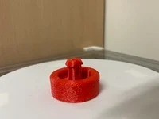
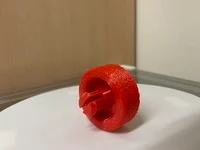

# Overview
This replacement wheel is suitable as an unofficial replacement for the Airbot Supersonics 3.0. The original wheel of my vacuum cleaner broke and I didn't want to buy an entirely new attachment just to replace it. 

# Design
This was designed with the print orientation and strength in mind. The wheel has to be strong enough such that it doesn't break easily, hence the thick walls setting and chamfered edge on the stalk.

# Print Settings
- Material:PLA / PETG
- Print settings: 
    - Walls: 4
    - Bottom part of the object: enable fuzzy skin
    - Infill: 20% Gyroid

# Images

# More
- Printables: https://printables.com/@SiahYeeLong_2539073
- Thingiverse: https://thingiverse.com/syeelong/
- Makerworld: https://makerworld.com/en/@yeelong
- GitHub: https://github.com/siahyeelong/3D-Printing-Projects
- LinkedIn: https://linkedin.com/in/siahyeelong/
