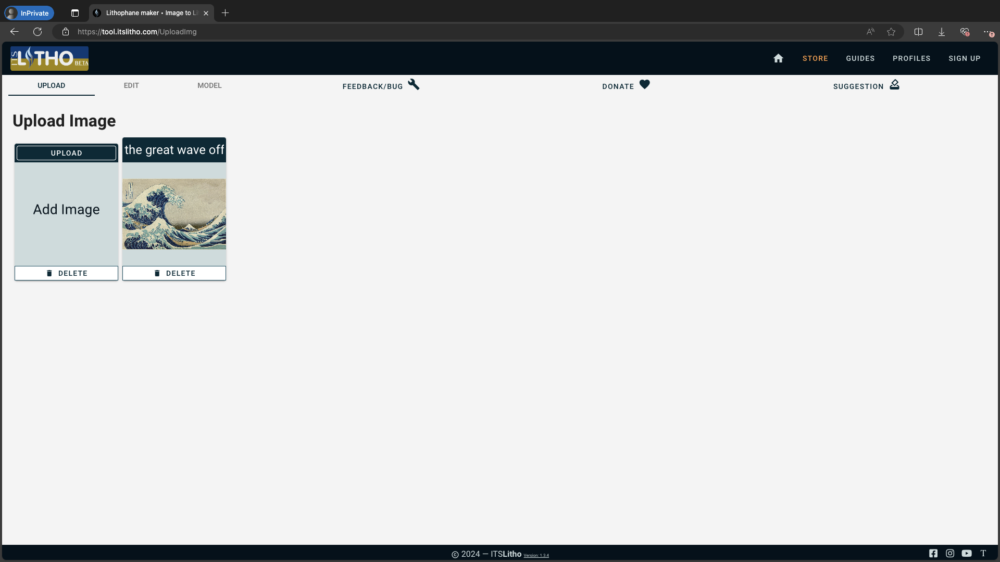
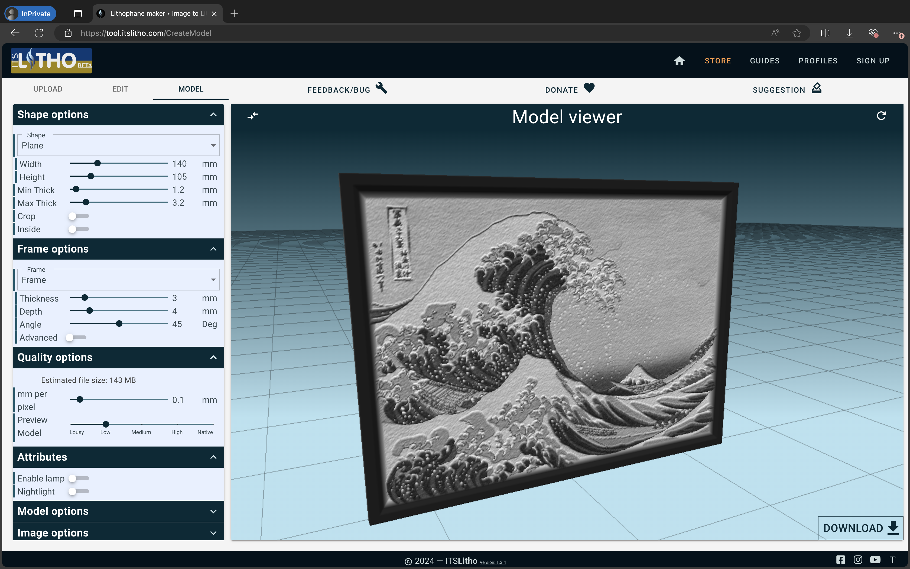
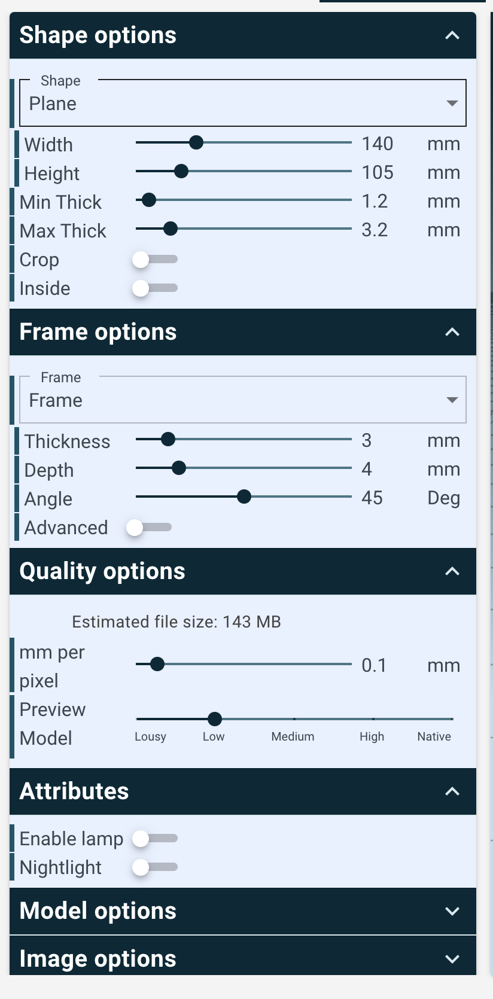
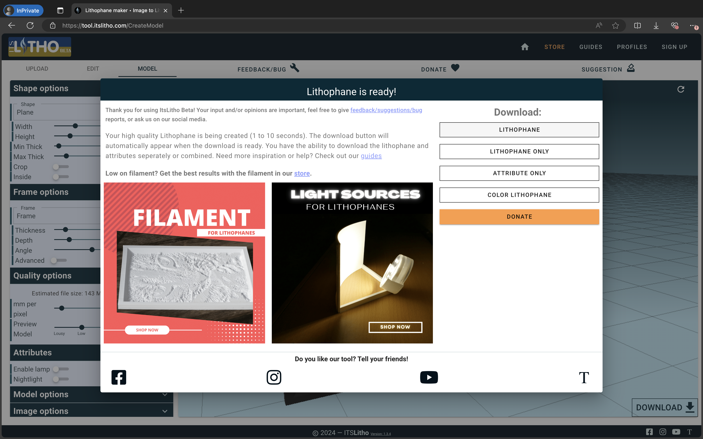

# Overview
This is a lithophane light box that I have designed myself as a side project. To light up the lithophane from the back, an LED strip is attached at the back, with a USB-C connector to power the LED. Assembly instructions are written in the [Usage](#usage) section.

 

# Usage

Bill of materials:
1. 5V LED light strip 3528 (I got mine [here](https://a.aliexpress.com/_oE7EGl1)) 

    

1. USB-C female plug (I got mine [here](https://a.aliexpress.com/_okP0abd))

    

To be printed:
1. 1x main body.stl
1. 1x back panel.stl
1. 1x lithophane (generate this for yourself, instructions below)

## 1. Generating a lithophane
Go to the [ItsLitho](https://tool.itslitho.com/UploadImg) website to generate a lithophane from an image. Ensure that your image is cropped to a 4:3 aspect ratio for compatibility with this Light Box. Upload your image on the site.

Click on the "model" tab to generate your lithophane.

On the left panel, ensure the settings correspond accordingly:
1. height x width = 105 x 140 mm
1. min thick = 1.2mm

Download the model with the button on the bottom right.

## 2. Printing the lithophanes
Load the generated stl into your slicer (I'm using Bambu Studio but you may use Cura, PrusaSlicer, OrcaSlicer or other slicers)

Material wise, I use a matte white PLA filament, but any white filament should work. Avoid using white filaments advertised as warm / cool. Surprisingly, I find cheaper filaments work better as they're less opaque.
Slicer settings for lithophanes:
- Layer height: 1.2mm
- Brim type: Outer brims only (basically enable brims)
- Wall loops: 99999999
- Top surface pattern: Concentric
- Bottom surface pattern: Concentric
- Infill: 100% Concentric
- Speed: to your liking, preferably slower

For the light box itself, use the following print settings:
- Layer height: 2.0mm
- Brim type: None 
- Wall loops: 2
- Infill: 15% Lightning (avoid using gyroid, the infill might look gross when the light shines from the inside)

## 3. Assembly
1. Solder the USB-C connector to the 5V LED strip and test that it works

    
    

1. Slot in the USB-C connector and LED strip through the hole of the `back panel` and snap the USB-C plug into place

    

1. Stick the LED strip around the sides of `back panel`

    

1. Insert the `lithophane` into the `main body`

    
    

1. Fit the `back panel` and `main body` together

    
    

1. Light up the light box with a USB-C charging cable (for some reason apple chargers don't work. try using a power bank)

    
    

# Future Ideas
- Create a battery-powered version instead

# More
- Printables: https://printables.com/@SiahYeeLong_2539073
- Thingiverse: https://thingiverse.com/syeelong/
- Makerworld: https://makerworld.com/en/@yeelong
- GitHub: https://github.com/siahyeelong/3D-Printing-Projects
- LinkedIn: https://linkedin.com/in/siahyeelong/
